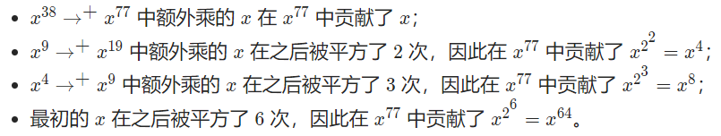

# 题目

[两数相除 - 两数相除 - 力扣（LeetCode）](https://leetcode.cn/problems/divide-two-integers/solution/liang-shu-xiang-chu-by-leetcode-solution-5hic/)

[Pow(x, n) - Pow(x, n) - 力扣（LeetCode）](https://leetcode.cn/problems/powx-n/solution/powx-n-by-leetcode-solution/)

# 介绍

在两数相除题目中，要求我们不能使用乘法和除法实现两数相除的取整操作，暴力地使用减法实现会超时：

```c++
#define OVER 0x7fffffff
#define MIN 0x80000000
class Solution {
public:
    int divide(int dividend, int divisor) {
        bool negDividend = dividend < 0;
        bool negDivisor = divisor < 0;
        if (divisor == 1){
            return dividend;
        }
        if (divisor == -1){
            if (dividend == MIN){
                return OVER;
            }
            return -dividend;
        }
        dividend = dividend > 0 ? -dividend : dividend;
        divisor = divisor > 0 ? -divisor : divisor;
        if (divisor == 0){
            return OVER;
        }
        if (divisor == 1){
            return dividend;
        }
        if (divisor == -1){
            if (dividend == MIN){
                return OVER;
            }
            return -dividend;
        }
        int ans = 0;
        int left = dividend;
        while(left <= divisor){
            left = left - divisor;
            if (ans == MIN){
                return OVER;
            }
            ans--;
            if (ans == MIN && negDividend == negDivisor){
                return OVER;
            }
        }
        return negDividend == negDivisor ? -ans : ans;
    }
};
```

# 快速幂

只要$N>=1$, $N$移位后一定会执行`N % 2 == 1`语句块；

`x_contribute`记录的是$x^{2}$, $x^{4}$, $x^{8}$之类的快速值，

$x^{77}$

| $N$             | 77           | 38      | 19      | 9       | 4        | 2        | 1        | 0    |
| --------------- | ------------ | ------- | ------- | ------- | -------- | -------- | -------- | ---- |
| $ans$           | $x$          | $x$     | $x^{5}$ | $x^{13}$ | $x^{13}$ | $x^{13}$ | $x^{77}$ | break |
| $x\_contribute$ | $x^{2}$ | $x^{4}$ | $x^{8}$ | $x^{16}$ | $x^{32}$ | $x^{64}$ | $x^{128}$ |      |


```c++
class Solution {
public:
    double quickMul(double x, long long N) {
        double ans = 1.0;
        // 贡献的初始值为 x
        double x_contribute = x;
        // 在对 N 进行二进制拆分的同时计算答案
        while (N > 0) {
            if (N % 2 == 1) {
                // 如果 N 二进制表示的最低位为 1，那么需要计入贡献
                ans *= x_contribute;
            }
            // 将贡献不断地平方
            x_contribute *= x_contribute;
            // 舍弃 N 二进制表示的最低位，这样我们每次只要判断最低位即可
            N /= 2;
        }
        return ans;
    }

    double myPow(double x, int n) {
        long long N = n;
        return N >= 0 ? quickMul(x, N) : 1.0 / quickMul(x, -N);
    }
};
```

##　理解

我们以 $x^{77}$ 作为例子：

$$ x\rightarrow x^{2}\rightarrow x^{4}\rightarrow +x^{9}\rightarrow +x^{19}\rightarrow x^{38}\rightarrow +x^{77} $$

把需要额外乘 x*x* 的步骤打上了 $+$ 标记。可以发现：



即 $$x^{77} = x\times x^{4}\times x^{8}\times x^{64} $$ ；

**1, 4, 8, 64 分别对应77的二进制表示$(1001101)_{2}$中的每个1**！

因此我们借助整数的二进制拆分，就可以得到迭代计算的方法，一般地，如果整数 $$n$$ 的二进制拆分为：

$$ n=2^{i0} + 2^{i1}+\cdots +2^{ik} $$

那么：

$$ x^{n}=x^{2^{i0}}\times x^{2^{i1}}\times \cdots \times x^{2^{ik}} $$

这样以来，我们从$x$开始不断地进行平方，得到$x^{2},x^{4},x^{8},\dots,$ 如果$n$的第$k$（从右往做，从0开始）二进制位为1，就将对应的共享$x^{2^{k}}$计入答案。


# 快速乘算法

查找备选：**使用移位运算实现二分查找；**

验证备选：**快速乘**

`z & 1`表示是否是奇数

$y=-4$, $z=27$, $x=-77$;

$result=0$, $add=-4$;

| z      | 27   | 13   | 6    | 3    | 2    | 1    | 0     |
| ------ | ---- | ---- | ---- | ---- | ---- | ---- | ----- |
| x-add  | -73  | -69  | -69  | -45  | -45  | 51   |       |
| result | -4   | -12  | -12  | -48  | -48  | -    | break |
| add    | -8   | -16  | -32  | -64  | -128 | -    |       |

```c++
auto quickAdd = [](int y, int z, int x)
{
    // x 和 y 是负数，z 是正数
    // 需要判断 z * y >= x 是否成立
    int result = 0, add = y;
    while (z)
    {
      	//z % 2 == 1
        if (z & 1) 
        {
            // 需要保证 result + add >= x
          	// 写成 result + add 更好理解 < x
            if (result < x - add)
            {
                return false;
            }
            result += add;
        }
      // add = add * 2;
      // z = z / 2;
      // 当z = 1时，停止
      // 把快速幂中的x*x 换成 x+x
        if (z != 1)
        {
            // 需要保证 add + add >= x
            if (add < x - add)
            {
                return false;
            }
            add += add;
        }
        // 不能使用除法
        z >>= 1;
    }
    return true;
};
```

## 理解

以$z=13$的情况为例，要执行**4**次循环（**13**， 6， **3**， 1）（6，3，1，0）；

我们要快速计算$13*y$;

比较$y, 2y, 4y, 8y$

而13并不在这个等比数量中，

13 => y

3 => 5y

在最后一次循环，将$5y$与$x-8y$进行比较。

13 = $(1101)_{2}$, $2^{0}+2^{2}+2^{3}$

$2^{0}+2^{2}$ = 5

$2^{3}=8$

代码中的判断语句写成 $result + add < x$ 更好理解，即用快速乘计算完 $y*z$ 的结果后，再与 $x$ 进行比较。
