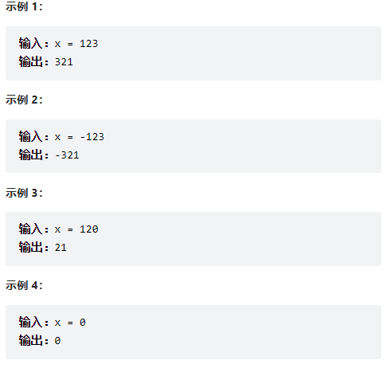

# 题目

[7. 整数反转 - 力扣（LeetCode）](https://leetcode.cn/problems/reverse-integer/)

> 给你一个 32 位的有符号整数 x ，返回将 x 中的数字部分反转后的结果。
>
> 如果反转后整数超过 32 位的有符号整数的范围 [−231,  231 − 1] ，就返回 0。
>
> 假设环境不允许存储 64 位整数（有符号或无符号）。
>
> 来源：力扣（LeetCode）
> 链接：https://leetcode.cn/problems/reverse-integer
> 著作权归领扣网络所有。商业转载请联系官方授权，非商业转载请注明出处。



# 解题

本题的方法很简单，不考虑溢出的情况下，对`x`进行求整和求余操作即可：

```c++
int rev = 0;
while (x != 0) {
  int digit = x % 10;
  x /= 10;
  rev = rev * 10 + digit;
}
```

# 溢出条件推导

$$
\begin{aligned}
INT_{-} M A X &=\left\lfloor\frac{I N T_{-} M A X}{10}\right\rfloor \cdot 10+\left(I N T_{-} M A X \bmod 10\right) \\
&=\left\lfloor\frac{I N T_{-} M A X}{10}\right\rfloor \cdot 10+7
\end{aligned}
$$

则不等式
$$
rev*10+digit \le INT\_MAX
$$
等价于
$$
\text { rev } \cdot 10+\text { digit } \leq\left\lfloor\frac{I N T_{-} M A X}{10}\right\rfloor \cdot 10+7
$$
移项得
$$
\left(\text { rev }-\left\lfloor\frac{I N T_{-} M A X}{10}\right\rfloor\right) \cdot 10 \leq 7-\text { digit }
$$
若 rev $>\left\lfloor\frac{I N T_{-M A X}}{10}\right\rfloor$ ，由于 digit $\geq 0$ ，不等式不成立。
若 $r e v=\left\lfloor\frac{I N T-M A X}{10}\right\rfloor$ ，当且仅当 digit $\leq 7$ 时，不等式成立。
若 rev $<\left\lfloor\frac{I N T_{M} M A X}{10}\right\rfloor$ ，由于 digit $\leq 9$ ，不等式成立。
注意到当 $r e v=\left\lfloor\frac{I N T_{-} M A X}{10}\right\rfloor$ 时若还能推入数字，则说明 $x$ 的位数与 $I N T_{-} M A X$ 的位数相同，且要推入的数 字 digit 为 $x$ 的最高位。由于 $x$ 不超过 INT_MAX，因此 digit 不会超过 INT_MAX 的最高位，即 digit $\leq 2$。

所以实际上当 $r e v=\left\lfloor\frac{I N T\_M A X}{10}\right\rfloor$ 时不等式必定成立。
因此判定条件可简化为: 当且仅当 $r e v \leq\left\lfloor\frac{I N T\_M A X}{10}\right\rfloor$ 时，不等式成立。

同理得负数情况下的成立条件： $r e v \geq \left\lfloor\frac{I N T\_MIN}{10}\right\rfloor$ 

# 代码

```c++
class Solution {
public:
    int reverse(int x) {
        int rev = 0;
        while (x != 0) {
            if (rev < INT_MIN / 10 || rev > INT_MAX / 10) {
                return 0;
            }
            int digit = x % 10;
            x /= 10;
            rev = rev * 10 + digit;
        }
        return rev;
    }
};
```

